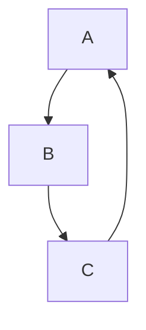
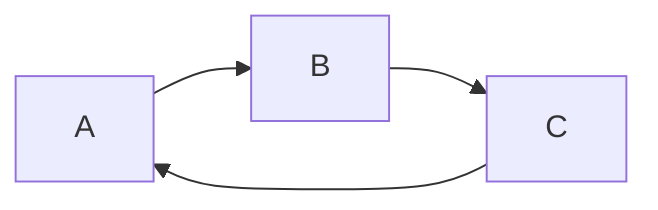
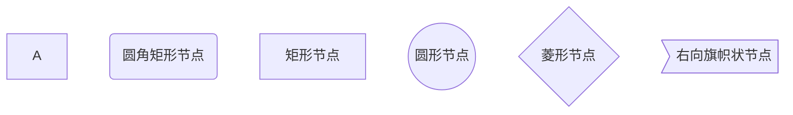
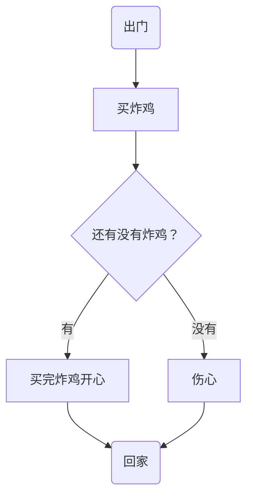
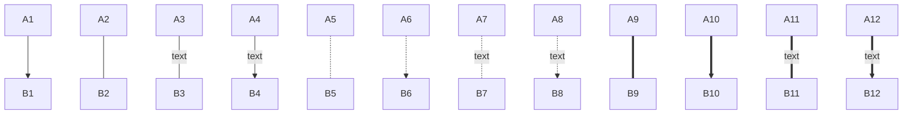
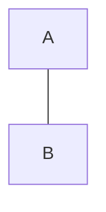
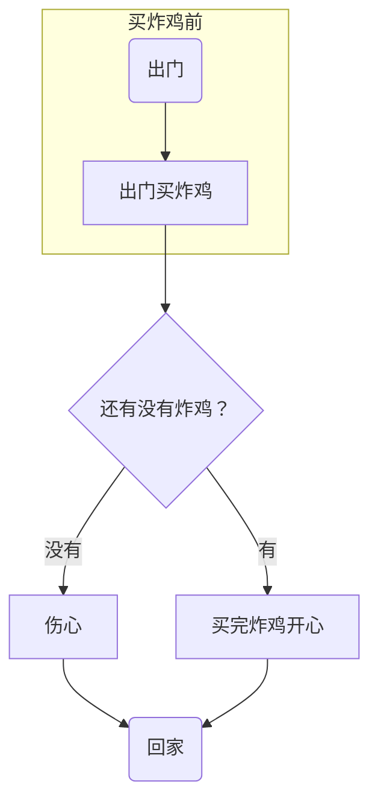
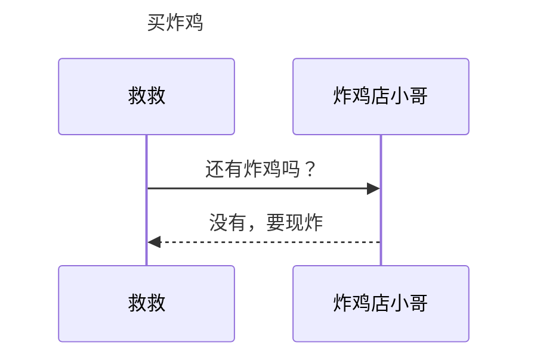
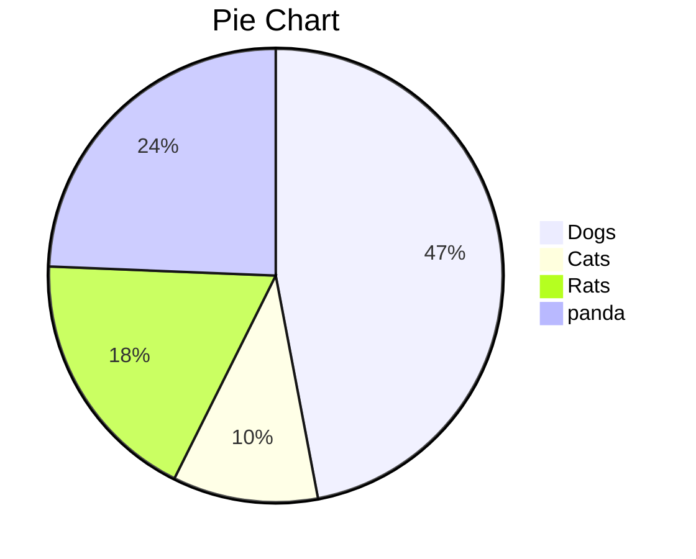
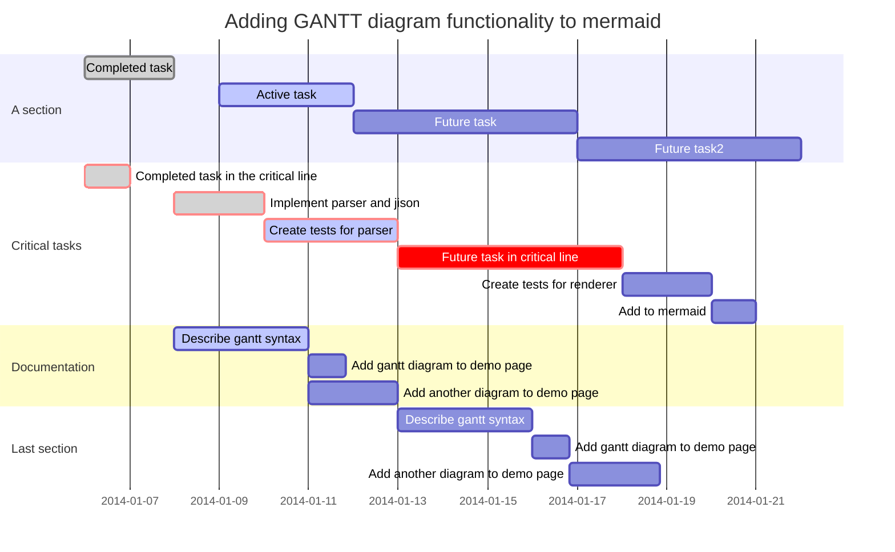

# markdown的使用说明

## 一、标题

>语法：# (一级标题)  ## (二级标题)  ### (三级标题) ......

>代码：
>
>```text
># 这是一级标题
>## 这是二级标题
>```

>效果:  
>
># 这是一级标题
>
>## 这是二级标题

>快捷键:
>
>* Ctrl+数字1~6可以快速将选中的文本调成对应级别的标题
>* Ctrl+0可以快速将选中的文本调成普通文本
>* Ctrl+加号/减号对标题级别进行加减

## 二、段落

### 1、换行


>代码:  
>
>```text
>这是一个段落
>这是一个段落
>```

>效果: 
>
>这是一个段落
>这是一个段落

### 2、分割线

>语法:  ---或者***+回车

>代码:
>
>```text
>---或者***
>```

>效果:
>
>---

## 三、文字显示

### 1、字体

>语法:
>
>* 粗体:  用一对双星号包裹
>* 删除线:  用一对双飘号包裹
>* 下划线:  用一对u标签包裹
>* 斜体:  用一对单星号包裹
>* 高亮:  用一对双等号包裹

>代码:
>
>```text
>**这是粗体**
>~~这是删除线~~
><u>这是下划线</u>
>*这是斜体*
>==这是高亮==
>```

>效果:
>**这是粗体**
>~~这是删除线~~
><u>这是下划线</u>
>*这是斜体*
>==这是高亮==

>快捷键:
>
>* 加粗:  Ctrl+B
>* 删除线:  Shift+Alt+5
>* 下划线:  Ctrl+U
>* 斜体:  Ctrl+I

### 2、上下标

>代码:
>
>```text
>x^2^
>H~2~O
>```

>效果:
>x^2^
>H~2~O

## 四、列表

### 1、无序列表

>代码:
>
>```text
>*/-/+ +空格
>```

>效果:
>1.只有同一级别:
>
>* 苹果
>* 香蕉
>* 橘子
>
>2.子集类:
>
>* 一级分类
>  * 二级分类 
>    * 三级分类

>快捷键:  Ctrl+Shift+]

### 2、有序列表

>代码:
>
>```text
>数字+.+空格
>```

>效果:
>
>1. 第一个标题
>2. 第二个标题
>3. 第三个标题
>
>   * 子内容1
>     * 子内容2
>4. 第四个标题

>快捷键:  Ctrl+Shift+[

### 3、任务列表

>代码:
>
>```text
>- [ ] 吃早餐
>- [x] 背单词
>```

>效果:
>
>- [ ] 吃早餐
>- [x] 背单词

## 五、区块显示

>代码:
>
>```text
>>+回车
>```

>效果:
>
>>这是最外层区块
>
>>>这是内层区块
>
>>>>这是最内层区块

## 六、代码显示

### 1、行内代码

>代码:
>
>```text
>`int a=0;`（说明：`位于Esc下面）
>```

>效果:
>`int a=0;`

>快捷键:  Ctrl+Shift+`

### 2、代码块

>代码:
>
>````text
>```js/java/c#/text
>内容
>```
>````

>快捷键:  Ctrl+Shift+K

## 七、链接

>代码:
>
>```text
>www.baidu.com
>[百度一下](https://www.baidu.com)
>[百度一下](https://www.baidu.com "https://www.baidu.com")
>```

>效果:
>www.baidu.com
>[百度一下](https://www.baidu.com)
>[百度一下](https://www.baidu.com "https://www.baidu.com")

>快捷键:  Ctrl+K

## 八、脚注

>说明:  对文本进行解释说明。

>代码: 
>
>```text
>[^文本]
>[^文本]:解释说明
>```

>效果:
>这是一个技术[^①]
>
>[^①]: 这是一个非常好用的框架。

## 九、图片插入

>代码:
>
>```text
>
>```

>效果:
>
>
>(注：效果路径为C:\Users\asus\Pictures\Saved Pictures\Snipaste_2020-09-03_13-19-11.png。在其他电脑上可能不显示。)

>快捷键:  Ctrl+Shift+I

## 十、表格

>代码:
>
>```text
>|  1   |  2   |  3   |
>| :--- | :--: | ---: |
>|  4   |  5   |  6   |
>|  7   |  8   |  9   |
>|  10  |  11  |  12  |
>```

>效果:
>
>| 1    |  2   |    3 |
>| ---- | :--: | ---: |
>| 4    |  5   |    6 |
>| 7    |  8   |    9 |
>| 10   |  11  |   12 |

>快捷键:  Ctrl+T

## 十一、流程图

### 1、横向流程图

> 代码:
>
> ````text
> ```mermaid
> graph LR
> A[方形]==>B(圆角)
> B==>C{条件a}
> C-->|a=1|D[结果1]
> C-->|a=2|E[结果2]
> F[横向流程图]
> ```
> ````

>效果:
>
>```mermaid
>graph LR
>A[方形]==>B(圆角)
>B==>C{条件a}
>C-->|a=1|D[结果1]
>C-->|a=2|E[结果2]
>F[横向流程图]
>```

### 2、竖向流程图

> 代码:
>
> ````text
> ```mermaid
> graph TD
> A[方形]==>B(圆角)
> B==>C{条件a}
> C-->|a=1|D[结果1]
> C-->|a=2|E[结果2]
> F[竖向流程图]
> ```
> ````

>效果:
>
>```mermaid
>graph TD
>A[方形]==>B(圆角)
>B==>C{条件a}
>C-->|a=1|D[结果1]
>C-->|a=2|E[结果2]
>F[竖向流程图]
>```

## 十二、表情符号

>代码:
>
>```text
>:happy:、:cry:、:man:
>```

>效果:
>:happy:、 :cry:、 :man:

## 十三、数学公式的输入

### 1、公式的插入

#### ①行中公式

>代码:
>
>```text
>$公式$
>```

>效果:
>$公式$

#### ②独立公式

>代码:
>
>```text
>$$
>公式
>$$
>```

>效果:
>$$
>公式
>$$

### 2、上下标

>代码:
>
>```text
>$x^{y^z}=(1+e^x)^{-2xy^w}$
>$\sideset{^1_2}{^3_4}{\underset{6}\bigotimes}$
>```

>效果:
>$x^{y^z}=(1+e^x)^{-2xy^w}$
>$\sideset{^1_2}{^3_4}{\underset{6}\bigotimes}$

### 3、括号和分隔符

>代码:
>
>```text
>$\langle\quad\rangle\quad\lceil\quad\rceil\quad\lfloor\quad\rfloor\quad\lbrace\quad\rbrace\quad\lVert\quad\rVert$
>$f(x,y,z)=3y^2z\left(3+\dfrac{7x+5}{1+y^2}\right)$
>$\left.\dfrac{\mathrm{d}u}{\mathrm{d}x}\right|_{x=0}$
>```

>效果:
>$\langle\quad\rangle\quad\lceil\quad\rceil\quad\lfloor\quad\rfloor\quad\lbrace\quad\rbrace\quad\lVert\quad\rVert$
>$f(x,y,z)=3y^2z\left(3+\dfrac{7x+5}{1+y^2}\right)$
>$\left.\dfrac{\mathrm{d}u}{\mathrm{d}x}\right|_{x=0}$

### 4、分数

>代码:
>
>```text
>$\frac{a}{b}\quad\dfrac{a}{b}\quad {a\over b}$
>```

>效果:
>$\frac{a}{b}\quad\dfrac{a}{b}\quad {a\over b}$

### 5、开方

>代码:
>
>```text
>$\sqrt[根指数,省略时为2]{被开方数}$
>```

>效果:
>$\sqrt{2}\quad\sqrt[3]{2}$

### 6、省略号

>代码:
>
>```text
>$\cdots\quad\ldots\quad\vdots\quad\ddots$
>```

>效果:
>$\cdots\quad\ldots\quad\vdots\quad\ddots$

### 7、矢量和均值

>代码:
>
>```text
>$\overrightarrow{E(\vec{r})}\quad\overleftarrow{E(\vec{r})}\quad\overleftrightarrow{E(\vec{r})}\quad\underrightarrow{E(\vec{r})}\quad\underleftarrow{E(\vec{r})}\quad\underleftrightarrow{E(\vec{r})}\quad\overline{v}=\bar{v}\quad\underline{v}$
>```

>效果:
>$\overrightarrow{E(\vec{r})}\quad\overleftarrow{E(\vec{r})}\quad\overleftrightarrow{E(\vec{r})}\quad\underrightarrow{E(\vec{r})}\quad\underleftarrow{E(\vec{r})}\quad\underleftrightarrow{E(\vec{r})}\quad\overline{v}=\bar{v}\quad\underline{v}$

### 8、积分

>代码:
>
>```text
>$$
>\iint\limits_D\left(\dfrac{\partial Q}{\partial x}-\dfrac{\partial P}{\partial y}\right){\rm d}x{\rm d}y=\oint\limits_LP{\rm d}x+Q{\rm d}y
>$$
>```

>效果:
>$$
>\iint\limits_D\left(\dfrac{\partial Q}{\partial x}-\dfrac{\partial P}{\partial y}\right){\rm d}x{\rm d}y=\oint\limits_LP{\rm d}x+Q{\rm d}y
>$$

### 9、极限

>代码:
>
>```text
>$\lim\limits_{n\to\infin}(1+\dfrac{1}{n})^n=e$
>```

>效果:
>$\lim\limits_{n\to\infin}(1+\dfrac{1}{n})^n=e$

### 10、累加、累乘及交集、并集

>```text
>$\sum\limits_{i=1}^n\dfrac{1}{n^2}\quad and\quad\prod\limits_{i=1}^n\dfrac{1}{n^2}\quad and\quad\bigcup\limits_{i=1}^n\dfrac{1}{n^2}\quad and\quad\bigcap\limits_{i=1}^n\dfrac{1}{n^2}$
>```

>效果:
>$\sum\limits_{i=1}^n\dfrac{1}{n^2}\quad and\quad\prod\limits_{i=1}^n\dfrac{1}{n^2}\quad and\quad\bigcup\limits_{i=1}^n\dfrac{1}{n^2}\quad and\quad\bigcap\limits_{i=1}^n\dfrac{1}{n^2}$

### 11、希腊字母

| 语法                          | 字母                            | 语法                    | 字母                      | 语法               | 字母                 |
| ----------------------------- | ------------------------------- | ----------------------- | ------------------------- | ------------------ | -------------------- |
| \Alpha(\alpha)                | $\Alpha(\alpha)$                | \Beta(\beta)            | $\Beta(\beta)$            | \Gamma(\gamma)     | $\Gamma(\gamma)$     |
| \Epsilon(\epsilon)\varepsilon | $\Epsilon(\epsilon)\varepsilon$ | \Zeta(\zeta)            | $\Zeta(\zeta)$            | \Eta(\eta)         | $\Eta(\eta)$         |
| \Iota(\iota)                  | $\Iota(\iota)$                  | \Kappa(\kappa)\varkappa | $\Kappa(\kappa)\varkappa$ | \Lambda(\lambda)   | $\Lambda(\lambda)$   |
| \Nu(\nu)                      | $\Nu(\nu)$                      | \Xi(\xi)                | $\Xi(\xi)$                | \Omicron(\omicron) | $\Omicron(\omicron)$ |
| \Rho(\rho)\varrho             | $\Rho(\rho)\varrho$             | \Sigma(\sigma)\varsigma | $\Sigma(\sigma)\varsigma$ | \Tau(\tau)         | $\Tau(\tau)$         |
| \Phi(\phi)\varphi             | $\Phi(\phi)\varphi$             | \Chi(\chi)              | $\Chi(\chi)$              | \Psi(\psi)         | $\Psi(\psi)$         |
| \Delta(\delta)                | $\Delta(\delta)$                | \Theta(\theta)\vartheta | $\Theta(\theta)\vartheta$ | \Mu(\mu)           | $\Mu(\mu)$           |
| \Pi(\pi)\varpi                | $\Pi(\pi)\varpi$                | \Omega(\omega)          | $\Omega(\omega)$          | \upsilon           | $\upsilon$           |
| \ell                          | $\ell$                          | \eth                    | $\eth$                    | \hbar              | $\hbar$              |
| \hslash                       | $\hslash$                       | \mho                    | $\mho$                    | \partial           | $\partial$           |

### 12、特殊字符

#### ①说明

>可以在字符前使用`\large`或`\small`以显示更大或更小的字符。${\LARGE A}{\Large A}{\large A}A{\small A}$

#### ②关系运算符

| 输入      | 显示        | 输入              | 显示                | 输入         | 显示         |
| --------- | ----------- | ----------------- | ------------------- | ------------ | ------------ |
| \pm(\mp)  | $\pm(\mp)$  | \times            | $\times$            | \div         | $\div$       |
| \nmid     | $\nmid$     | \cdot             | $\cdot$             | \mid         | $\mid$       |
| \bigodot  | $\bigodot$  | \bigotimes        | $\bigotimes$        | \bigoplus    | $\bigoplus$  |
| \ge       | $\ge$       | \le               | $\le$               | \ll          | $\ll$        |
| \geqslant | $\geqslant$ | \leqslant         | $\leqslant$         | \neq         | $\neq$       |
| \approx   | $\approx$   | \xlongequal{文本} | $\xlongequal{文本}$ | \triangleq   | $\triangleq$ |
| \sim      | $\sim$      | \doteq            | $\doteq$            | \equiv       | $\equiv$     |
| \cong     | $\cong$     | \propto           | $\propto$           | \parallel(\\ | )            |
| \prec     | $\prec$     | \pmod{2}          | $\pmod{2}$          | \bmod        | $\bmod{2}$   |

#### ③集合运算符

| 输入      | 显示        | 输入        | 显示          | 输入       | 显示         |
| --------- | ----------- | ----------- | ------------- | ---------- | ------------ |
| \emptyset | $\emptyset$ | \varnothing | $\varnothing$ |            |              |
| \subset   | $\subset$   | \subseteq   | $\subseteq$   | \subsetneq | $\subsetneq$ |
| \supset   | $\supset$   | \supseteq   | $\supseteq$   | \supsetneq | $\supsetneq$ |
| \bigcap   | $\bigcap$   | \bigcup     | $\bigcup$     | \setminus  | $\setminus$  |
| \bigvee   | $\bigvee$   | \bigwedge   | $\bigwedge$   |            |              |
| \in       | $\in$       | \notin      | $\notin$      | \ni        | $\ni$        |

#### ④三角运算符

| 输入    | 显示      | 输入 | 显示   | 输入   | 显示     |
| ------- | --------- | ---- | ------ | ------ | -------- |
| \circ   | $\circ$   | \bot | $\bot$ | \angle | $\angle$ |
| \degree | $\degree$ |      |        |        |          |

#### ⑤微积分运算符

| 输入  | 显示    | 输入   | 显示     | 输入      | 显示     |
| ----- | ------- | ------ | -------- | --------- | -------- |
| \int  | $\int$  | \iint  | $\iint$  | \iiint    | $\iiint$ |
| \oint | $\oint$ | \oiint | $\oiint$ | \prime(‘) | $\prime$ |
| \lim  | $\lim$  | \infin | $\infin$ | \nabla    | $\nabla$ |
| \grad | $\grad$ |        |          |           |          |

#### ⑥逻辑运算符

| 输入     | 显示       | 输入       | 显示         | 输入   | 显示     |
| -------- | ---------- | ---------- | ------------ | ------ | -------- |
| \because | $\because$ | \therefore | $\therefore$ |        |          |
| \forall  | $\forall$  | \exist     | $\exist$     |        |          |
| \not>    | $\not>$    | \not<      | $\not<$      |        |          |
| \land    | $\land$    | \lor       | $\lor$       | \lnot  | $\lnot$  |
| \top     | $\top$     | \vdash     | $\vdash$     | \vDash | $\vDash$ |

#### ⑦带帽符号

| 输入           | 显示             | 输入            | 显示              |
| -------------- | ---------------- | --------------- | ----------------- |
| \hat{xy}       | $\hat{xy}$       | \widehat{xyz}   | $\widehat{xyz}$   |
| \tilde{xy}     | $\tilde{xy}$     | \widetilde{xyz} | $\widetilde{xyz}$ |
| \check{x}      | $\check{x}$      | \breve{y}       | $\breve{y}$       |
| \grave{x}      | $\grave{x}$      | \acute{y}       | $\acute{y}$       |
| \dot{x}        | $\dot{x}$        | \ddot{x}        | $\ddot{x}$        |
| \overparen{xy} | $\overparen{xy}$ |                 |                   |

#### ⑧选取符号

| 输入                           | 显示                             | 输入                            | 显示                              |
| ------------------------------ | -------------------------------- | ------------------------------- | --------------------------------- |
| \fbox{a+b+c+d}                 | $\fbox{a+b+c+d}$                 |                                 |                                   |
| \overbrace{xx\cdots x}^{10个x} | $\overbrace{xx\cdots x}^{10个x}$ | \underbrace{xx\cdots x}_{10个x} | $\underbrace{xx\cdots x}_{10个x}$ |


#### ⑨箭头符号

| 输入           | 显示             | 输入              | 显示                | 输入                | 显示                  |
| -------------- | ---------------- | ----------------- | ------------------- | ------------------- | --------------------- |
| \leftarrow     | $\leftarrow$     | \rightarrow       | $\rightarrow$       | \leftrightarrow     | $\leftrightarrow$     |
| \longleftarrow | $\longleftarrow$ | \longrightarrow   | $\longrightarrow$   | \longleftrightarrow | $\longleftrightarrow$ |
| \Leftarrow     | $\Leftarrow$     | \Rightarrow       | $\Rightarrow$       | \Leftrightarrow     | $\Leftrightarrow$     |
| \Longleftarrow | $\Longleftarrow$ | \Longrightarrow   | $\Longrightarrow$   | \Longleftrightarrow | $\Longleftrightarrow$ |
| \uparrow       | $\uparrow$       | \downarrow        | $\downarrow$        | \updownarrow        | $\updownarrow$        |
| \Uparrow       | $\Uparrow$       | \Downarrow        | $\Downarrow$        | \Updownarrow        | $\Updownarrow$        |
| \to            | $\to$            | \swarrow          | $\swarrow$          | \nearrow            | $\nearrow$            |
| \gets          | $\gets$          | \searrow          | $\searrow$          | \nwarrow            | $\nwarrow$            |
| \mapsto        | $\mapsto$        | \rightrightarrows | $\rightrightarrows$ |                     |                       |

#### ⑩空格

| 输入 | 效果   | 输入    | 效果   | 输入   | 效果       |
| ---- | ------ | ------- | ------ | ------ | ---------- |
| \\!  | $|\!|$ | 默认    | $||$   | \quad  | $|\quad|$  |
| \,   | $|\,|$ | \;(\\ ) | $|\;|$ | \qquad | $|\qquad|$ |

### 13、字体

> 代码:
>
> ```text
> ${\字体{需要转换的字符}}$
> ```

| 输入 | 说明     | 显示            | 输入  | 说明       | 显示              |
| ---- | -------- | --------------- | ----- | ---------- | ----------------- |
| \rm  | 罗马体   | ${\rm{Sample}}$ | \cal  | 花体       | ${\cal{Sample}}$  |
| \it  | 意大利体 | ${\it{Sample}}$ | \Bbb  | 黑板粗体   | ${\Bbb{Sample}}$  |
| \bf  | 粗体     | ${\bf{Sample}}$ | \mit  | 数学斜体   | ${\mit{Sample}}$  |
| \sf  | 等线体   | ${\sf{Sample}}$ | \scr  | 手写体     | ${\scr{Sample}}$  |
| \tt  | 打字机体 | ${\tt{Sample}}$ | \frak | 旧德式字体 | ${\frak{Sample}}$ |

### 14、大括号和行标

>说明:  使用`\left`和`\right`来创建自动匹配高度的`()`、`[]`、`{}`、`.`。在每个公式末尾使用`\tag{行标}`来实现行标。

>代码:
>
>```text
>$$
>f\left(
>\left[
>\dfrac{1+\{x,y\}}{\left(\dfrac{x}{y}+\dfrac{y}{x}\right)(u+1)}+a
>\right]
>^{\dfrac{3}{2}}
>\right)
>\tag{行标}
>$$
>```

>效果:
>$$
>f\left(\left[\dfrac{1+\{x,y\}}{\left(\dfrac{x}{y}+\dfrac{y}{x}\right)(u+1)}+a\right]^{\dfrac{3}{2}}\right)\tag{行标}
>$$

>说明:如果你想将行内显示的分隔符也变大,也可以使用`\middle`命令

>代码:
>
>```text
>$$
>\left\langle q\middle\|\dfrac{\dfrac{x}{y}}{\dfrac{u}{v}}\middle|p\right\rangle
>$$
>```

>效果:
>$$
>\left\langle q\middle\|\dfrac{\dfrac{x}{y}}{\dfrac{u}{v}}\middle|p\right\rangle
>$$

### 15、其他命令

#### ①注释文字

>代码:
>
>```text
>$\text{文字}$
>```

>效果:
>$$
>f(n)=\begin{cases}n/2,&\text{if $n$ is even}\\3n+1,&\text{if $n$ is odd}\end{cases}
>$$

#### ③文字颜色

>* 适用新旧浏览器
>  代码:
>
>```text
>$\color{颜色}{文字}$
>```

| 输入    | 显示                     | 输入   | 显示                    | 输入   | 显示                    |
| ------- | ------------------------ | ------ | ----------------------- | ------ | ----------------------- |
| black   | $\color{black}{color}$   | grey   | $\color{grey}{color}$   | silver | $\color{silver}{color}$ |
| white   | $\color{white}{color}$   | maroon | $\color{maroon}{color}$ | red    | $\color{red}{color}$    |
| yellow  | $\color{yellow}{color}$  | lime   | $\color{lime}{color}$   | olive  | $\color{olive}{color}$  |
| green   | $\color{green}{color}$   | teal   | $\color{teal}{color}$   | auqa   | $\color{auqa}{color}$   |
| blue    | $\color{blue}{color}$    | navy   | $\color{navy}{color}$   | purple | $\color{purple}{color}$ |
| fuchsia | $\color{fuchsia}{color}$ |        |                         |        |                         |

>* 适用新版浏览器
>  代码:
>
>```text
>$\color{#rgb}{文字}$    (注:其中r、g、b可以输入0~9和a~f来分别表示红色、绿色和蓝色的纯度)
>```

| 输入 | 输出                  | 输入 | 输出                  | 输入 | 输出                  | 输入 | 输出                  |
| ---- | --------------------- | ---- | --------------------- | ---- | --------------------- | ---- | --------------------- |
| #000 | $\color{#000}{color}$ | #005 | $\color{#005}{color}$ | #00A | $\color{#00A}{color}$ | #00F | $\color{#00F}{color}$ |
| #500 | $\color{#500}{color}$ | #505 | $\color{#505}{color}$ | #50A | $\color{#50A}{color}$ | #50F | $\color{#50F}{color}$ |
| #A00 | $\color{#A00}{color}$ | #A05 | $\color{#A05}{color}$ | #A0A | $\color{#A0A}{color}$ | #A0F | $\color{#A0F}{color}$ |
| #F00 | $\color{#F00}{color}$ | #F05 | $\color{#F05}{color}$ | #F0A | $\color{#F0A}{color}$ | #F0F | $\color{#F0F}{color}$ |
| #050 | $\color{#050}{color}$ | #055 | $\color{#055}{color}$ | #05A | $\color{#05A}{color}$ | #05F | $\color{#05F}{color}$ |
| #550 | $\color{#550}{color}$ | #555 | $\color{#555}{color}$ | #55A | $\color{#55A}{color}$ | #55F | $\color{#55F}{color}$ |
| #A50 | $\color{#A50}{color}$ | #A55 | $\color{#A55}{color}$ | #A5A | $\color{#A5A}{color}$ | #A5F | $\color{#A5F}{color}$ |
| #F50 | $\color{#F50}{color}$ | #F55 | $\color{#F55}{color}$ | #F5A | $\color{#F5A}{color}$ | #F5F | $\color{#F5F}{color}$ |
| #0A0 | $\color{#0A0}{color}$ | #0A5 | $\color{#0A5}{color}$ | #0AA | $\color{#0AA}{color}$ | #0AF | $\color{#0AF}{color}$ |
| #5A0 | $\color{#5A0}{color}$ | #5A5 | $\color{#5A5}{color}$ | #5AA | $\color{#5AA}{color}$ | #5AF | $\color{#5AF}{color}$ |
| #AA0 | $\color{#AA0}{color}$ | #AA5 | $\color{#AA5}{color}$ | #AAA | $\color{#AAA}{color}$ | #AAF | $\color{#AAF}{color}$ |
| #FA0 | $\color{#FA0}{color}$ | #FA5 | $\color{#FA5}{color}$ | #FAA | $\color{#FAA}{color}$ | #FAF | $\color{#FAF}{color}$ |
| #0F0 | $\color{#0F0}{color}$ | #0F5 | $\color{#0F5}{color}$ | #0FA | $\color{#0FA}{color}$ | #0FF | $\color{#0FF}{color}$ |
| #5F0 | $\color{#5F0}{color}$ | #5F5 | $\color{#5F5}{color}$ | #5FA | $\color{#5FA}{color}$ | #5FF | $\color{#5FF}{color}$ |
| #AF0 | $\color{#AF0}{color}$ | #AF5 | $\color{#AF5}{color}$ | #AFA | $\color{#AFA}{color}$ | #AFF | $\color{#AFF}{color}$ |
| #FF0 | $\color{#FF0}{color}$ | #FF5 | $\color{#FF5}{color}$ | #FFA | $\color{#FFA}{color}$ | #FFF | $\color{#FFF}{color}$ |

#### ③删除线

>说明:  使用`\require{cancle}`声明，再使用`\cancle{字符}`、`\bcancle{字符}`、`\xcancle{字符}`、`\cancleto{字符}{字符}`来实现各种**片段删除线**效果。

>代码:
>
>```text
>$$
>\require{cancel}\begin{array}{r1}
>\verb|y+\cancel{x}|&y+\cancel{x}\\
>\verb|y+\cancel{y+x}|&y+\cancel{y+x}\\
>\verb|y+\bcancel{x}|&y+\bcancel{x}\\
>\verb|y+\xcancel{x}|&y+\xcancel{x}\\
>\verb|y+\cancelto{0}{x}|&y+\cancelto{0}{x}\\
>\verb+\frac{1\cancel9}{\cancel95}=\frac15+&\frac{1\cancel9}{\cancel95}=\frac15\\
>\end{array}
>$$
>```

>效果:
>$$
>\require{cancel}\begin{array}{r1}
>\verb|y+\cancel{x}|&y+\cancel{x}\\
>\verb|y+\cancel{y+x}|&y+\cancel{y+x}\\
>\verb|y+\bcancel{x}|&y+\bcancel{x}\\
>\verb|y+\xcancel{x}|&y+\xcancel{x}\\
>\verb|y+\cancelto{0}{x}|&y+\cancelto{0}{x}\\
>\verb+\frac{1\cancel9}{\cancel95}=\frac15+&\frac{1\cancel9}{\cancel95}=\frac15\\
>\end{array}
>$$

>说明:  使用`\require{enclose}`来允许**整段删除线**的显示，再使用`\enclose{删除线效果}{字符}`来使用各种整段删除线效果。其中，删除线效果有`horizontalstrike`、`verticalstrike`、`updiagonalstrike`和`downdiagonalstrike`,可以叠加使用。

>代码:
>
>```text
>$$
>\require{enclose}\begin{array}{r1}
>\verb|\enclose{horizontalstrike}{x+y}|&\enclose{horizontalstrike}{x+y}\\
>\verb|\enclose{verticalstrike}{\frac xy}|&\enclose{verticalstrike}{\frac xy}\\
>\verb|\enclose{updiagonalstrike}{x+y}|&\enclose{updiagonalstrike}{x+y}\\
>\verb|\enclose{downdiagonalstrike}{x+y}|&\enclose{downdiagonalstrike}{x+y}\\
>\verb|\enclose{horizontalstrike,updiagonalstrike}{x+y}|&\enclose{horizontalstrike,updiagonalstrike}{x+y}\\
>\end{array}
>$$
>```

>效果:
>$$
>\require{enclose}\begin{array}{r1}
>\verb|\enclose{horizontalstrike}{x+y}|&\enclose{horizontalstrike}{x+y}\\
>\verb|\enclose{verticalstrike}{\frac xy}|&\enclose{verticalstrike}{\frac xy}\\
>\verb|\enclose{updiagonalstrike}{x+y}|&\enclose{updiagonalstrike}{x+y}\\
>\verb|\enclose{downdiagonalstrike}{x+y}|&\enclose{downdiagonalstrike}{x+y}\\
>\verb|\enclose{horizontalstrike,updiagonalstrike}{x+y}|&\enclose{horizontalstrike,updiagonalstrike}{x+y}\\
>\end{array}
>$$

### 16、矩阵

#### ①无框矩阵

>代码:
>
>```text
>$$
>\begin{matrix}
>1&x&x^2\\
>1&y&y^2\\
>1&z&z^2\\
>\end{matrix}
>$$
>```

>效果:
>$$
>\begin{matrix}
>1&x&x^2\\
>1&y&y^2\\
>1&z&z^2\\
>\end{matrix}
>$$

#### ②边框矩阵

>说明:  在开头将`matrix`替换为`pmatrix`、`bmatrix`、`Bmatrix`、`vmatrix`、`Vmatrix`。

| matrix                               | pmatrix                                | bmatrix                                | Bmatrix                                | vmatrix                                | Vmatrix                                |
| ------------------------------------ | -------------------------------------- | -------------------------------------- | -------------------------------------- | -------------------------------------- | -------------------------------------- |
| $\begin{matrix}1&2\\3&4\end{matrix}$ | $\begin{pmatrix}1&2\\3&4\end{pmatrix}$ | $\begin{bmatrix}1&2\\3&4\end{bmatrix}$ | $\begin{Bmatrix}1&2\\3&4\end{Bmatrix}$ | $\begin{vmatrix}1&2\\3&4\end{vmatrix}$ | $\begin{Vmatrix}1&2\\3&4\end{Vmatrix}$ |

#### ③带分割线的矩阵

>说明:  可以使用`cc|c`来在一个三列矩阵中插入分割线。

>代码:
>
>```text
>$$
>\left[
>\begin{array}{cc|c}
>1&2&3\\
>4&5&6
>\end{array}
>\right]
>$$
>```

>效果:
>$$
>\left[
>\begin{array}{cc|c}
>1&2&3\\
>4&5&6
>\end{array}
>\right]
>$$

#### ④行中矩阵

>代码:
>
>```text
>$\bigl(\begin{smallmatrix}a&b\\c&d\end{smallmatrix}\bigr)$
>```

>效果:
>$\bigl(\begin{smallmatrix}a&b\\c&d\end{smallmatrix}\bigr)$

### 17、方程式序列

>说明:  可以使用`\begin{align}...\end{align}`来创建一列整齐且默认右对齐的方程式序列。请注意`{align}`是**自动编号**的，使用`{align*}`来声明停止自动编号，也可以使用`\notag`来取消特定行的自动编号。在需要的时候，你可以使用`\begin{equation}...\end{equation}`来强制表达式自动编号。

>代码:
>$$
>\begin{align}
>f(x)&=1+1\\
>&=2
>\end{align}
>$$
>
>$$
>\begin{equation}
>\left[
>\begin{array}{cc|c}
>1&2&3\\
>4&5&6
>\end{array}
>\right]
>\end{equation}
>$$
>
>
>
>```text
>$$
>\begin{align}
>\sqrt{37}=\sqrt{\dfrac{73^2-1}{12^2}}\\
>&=\sqrt{\dfrac{73^2}{12^2}\cdot\dfrac{73^2-1}{73^2}}\\
>&=\sqrt{\dfrac{73^2}{12^2}}\sqrt{\dfrac{73^2-1}{73^2}}\notag\\
>&=\dfrac{73}{12}\sqrt{1-\dfrac{1}{73^2}}\\
>\approx\dfrac{73}{12}\left(1-\dfrac{1}{2\cdot73^2}\right)\label{A}
>\end{align}
>$$
>***
>
>$$
>\begin{align*}
>v+m&=0&\text{Given}\tag1\\
>-w&=-w+0&\text{additive identity}\tag2\\
>-w+0&=-w+(v+w)&\text{equations $(1)$ and $(2)$}
>\end{align*}
>$$
>```

>效果:
>$$
>\begin{align}
>\sqrt{37}&=\sqrt{\dfrac{73^2-1}{12^2}}\\
>&=\sqrt{\dfrac{73^2}{12^2}\cdot\dfrac{73^2-1}{73^2}}\\
>&=\sqrt{\dfrac{73^2}{12^2}}\sqrt{\dfrac{73^2-1}{73^2}}\notag\\
>&=\dfrac{73}{12}\sqrt{1-\dfrac{1}{73^2}}\\
>&\approx\dfrac{73}{12}\left(1-\dfrac{1}{2\cdot73^2}\right)\label{A}
>\end{align}
>$$
>
>***
>
>$$
>\begin{align*}
>v+m&=0&\text{Given}\tag1\\
>-w&=-w+0&\text{additive identity}\tag2\\
>-w+0&=-w+(v+w)&\text{equations $(1)$ and $(2)$}
>\end{align*}
>$$
>
>你可以使用`\label{标签}`来创建一个标签，就如上面的方程式序列中展示的那样，之后使用`\eqref{标签}`引用你想引用的公式，效果为：$\eqref{A}$。如果不想要括号，可以输入`\ref{标签}`，效果为：公式 $\ref{A}$。
>
>公式1和2的不同列之间存在间隔，如果你不想要，可以通过将`align`替换为`alignat{1}`来去除列间隔。

### 18、条件表达式

>说明:  使用`\begin{cases}`来创造一组默认左对齐的条件表达式,在每一行插入`&`来指定需要对齐的内容,并在每一行结尾处使用`\\`,以`\end{cases}`结尾。

>代码:
>
>```text
>$$
>f(n)=
>\begin{cases}
>n/2,&\text{if $n$ is even}\\
>3n+1,&\text{if $n$ is odd}
>\end{cases}
>$$
>```

>效果:
>$$
>f(n)=
>\begin{cases}
>n/2,&\text{if $n$ is even}\\
>3n+1,&\text{if $n$ is odd}
>\end{cases}
>$$

### 19、配置行高

>说明:  可以使用`\\[2ex]`语句替代该行末尾的`\\`来让编译器适配 , 其中`[ex]`指一个"X-Height" , 即x字母高度 , 也可以使用`[3ex]`或`[4ex]`等。

>代码:
>
>```text
>$$
>f(n)=
>\begin{cases}
>\dfrac n2,&\text{if $n$ is even}\\[2ex]
>3n+1,&\text{if $n$ is odd}
>\end{cases}\tag{适配[2ex]}
>$$
>***
>
>$$
>f(n)=
>\begin{cases}
>\dfrac n2,&\text{if $n$ is even}\\
>3n+1,&\text{if $n$ is odd}
>\end{cases}\tag{不适配[2ex]}
>$$
>```

>效果:
>$$
>f(n)=
>\begin{cases}
>\dfrac n2,&\text{if $n$ is even}\\[2ex]
>3n+1,&\text{if $n$ is odd}
>\end{cases}\tag{适配[2ex]}
>$$
>
>***
>
>$$
>f(n)=
>\begin{cases}
>\dfrac n2,&\text{if $n$ is even}\\
>3n+1,&\text{if $n$ is odd}
>\end{cases}\tag{不适配[2ex]}
>$$

### 20、数组与表格

>说明:  数组与表格均以`\begin{array}`开头,并在其后定义列数及每一列的文本对齐方式,`c` `l` `r`分别代表居中、左对齐及右对齐。若要插入垂直分割线，在定义中插入`|`，若要插入水平分割线，在定义中加入`\hline`。

>代码:
>
>```text
>$$
>\begin{array}{c|lcr}
>n&\text{左对齐}&\text{居中对齐}&\text{右对齐}\\
>\hline
>1&0.24&1&125\\
>2&-1&189&-8\\
>3&-20&2000&1+10i
>\end{array}
>$$
>```

>效果:
>$$
>\begin{array}{c|lcr}
>n&\text{左对齐}&\text{居中对齐}&\text{右对齐}\\
>\hline
>1&0.24&1&125\\
>2&-1&189&-8\\
>3&-20&2000&1+10i
>\end{array}
>$$

### 21、嵌套表格或数组

>代码:
>
>```text
>$$
>% outer vertical array of arrays 外层垂直表格
>\begin{array}{c}
>% inner horizontal array of arrays 内层水平表格
>\begin{array}{cc}
>% inner array of minimum values 内层"最小值"数组
>\begin{array}{c|cccc}
>\text{min}&0&1&2&3\\
>\hline
>0&0&0&0&0\\
>1&0&1&1&1\\
>2&0&1&2&2\\
>3&0&1&2&3\\
>\end{array}
>&
>% inner array of maximum values 内层"最大值"数组
>\begin{array}{c|cccc}
>\text{max}&0&1&2&3\\
>\hline
>0&0&1&2&3\\
>1&1&1&2&3\\
>2&2&2&2&3\\
>3&3&3&3&3
>\end{array}
>\end{array}
>% 内层第一行表格组结束
>\\
>% inner array of delta values 内层第二行Delta值数组
>\begin{array}{c|cccc}
>\Delta&0&1&2&3\\
>\hline
>0&0&1&2&3\\
>1&1&0&1&2\\
>2&2&1&0&1\\
>3&3&2&1&0
>\end{array}
>% 内层第二行表格组结束
>\end{array}
>$$
>```

>效果:
>$$
>% outer vertical array of arrays 外层垂直表格
>\begin{array}{c}
>% inner horizontal array of arrays 内层水平表格
>\begin{array}{cc}
>% inner array of minimum values 内层"最小值"数组
>\begin{array}{c|cccc}
>\text{min}&0&1&2&3\\
>\hline
>0&0&0&0&0\\
>1&0&1&1&1\\
>2&0&1&2&2\\
>3&0&1&2&3\\
>\end{array}
>&
>% inner array of maximum values 内层"最大值"数组
>\begin{array}{c|cccc}
>\text{max}&0&1&2&3\\
>\hline
>0&0&1&2&3\\
>1&1&1&2&3\\
>2&2&2&2&3\\
>3&3&3&3&3
>\end{array}
>\end{array}
>% 内层第一行表格组结束
>\\
>% inner array of delta values 内层第二行Delta值数组
>\begin{array}{c|cccc}
>\Delta&0&1&2&3\\
>\hline
>0&0&1&2&3\\
>1&1&0&1&2\\
>2&2&1&0&1\\
>3&3&2&1&0
>\end{array}
>% 内层第二行表格组结束
>\end{array}
>$$

### 22、方程组

>说明:  使用`\begin{array}...\end{array}`和`\left\{...\right.`来创建一个方程组,或者你也可以使用条件表达式组`\begin{cases}...\end{cases}`来实现相同效果。

>代码:
>
>```text
>$$
>\left\{
>\begin{array}{l}
>a_1x+b_1y+c_1z=d_1\\
>a_2x+b_2y+c_2z=d_2\\
>a_3x+b_3y+c_1z=d_3
>\end{array}
>\right.
>\quad\text{或者}\quad
>\begin{cases}
>a_1x+b_1y+c_1z=d_1\\
>a_2x+b_2y+c_2z=d_2\\
>a_3x+b_3y+c_1z=d_3
>\end{cases}
>$$
>```

>效果:
>$$
>\left\{
>\begin{array}{l}
>a_1x+b_1y+c_1z=d_1\\
>a_2x+b_2y+c_2z=d_2\\
>a_3x+b_3y+c_1z=d_3
>\end{array}
>\right.
>\quad\text{或者}\quad
>\begin{cases}
>a_1x+b_1y+c_1z=d_1\\
>a_2x+b_2y+c_2z=d_2\\
>a_3x+b_3y+c_1z=d_3
>\end{cases}
>$$

### 23、连分式

>说明:  就像`\frac`一样,使用`\cfrac`或`\dfrac`来创建一个连分式,不要使用普通的`\frac`或`\over`来创建,否则看起来会**很恶心**。

>代码:
>
>```text
>$$
>x=a_0+\cfrac{1^2}{a_1+\cfrac{2^2}{a_2+\cfrac{3^2}{a_3+\cfrac{4^2}{a_4+\cdots}}}}
>$$
>```

>效果:
>$$
>x=a_0+\cfrac{1^2}{a_1+\cfrac{2^2}{a_2+\cfrac{3^2}{a_3+\cfrac{4^2}{a_4+\cdots}}}}
>$$

>反例:
>
>```text
>x=a_0+\frac{1^2}{a_1+\frac{2^2}{a_2+\frac{3^2}{a_3+\frac{4^2}{a_4+\cdots}}}}
>```

>效果:
>$$
>x=a_0+\frac{1^2}{a_1+\frac{2^2}{a_2+\frac{3^2}{a_3+\frac{4^2}{a_4+\cdots}}}}
>$$

>补充:  当然,你可以使用`\frac`来表达连分数的**紧缩记法**。

>代码:
>
>```text
>$$
>x=a_0+\frac{1^2}{a_1+}\frac{2^2}{a_2+}\frac{3^2}{a_3+}\frac{4^2}{a_4+}\cdots
>$$
>```

>效果:
>$$
>x=a_0+\frac{1^2}{a_1+}\frac{2^2}{a_2+}\frac{3^2}{a_3+}\frac{4^2}{a_4+}\cdots
>$$

### 24、交换图表

>说明:  使用一行`$\require{AMScd}$`语句来允许交换图表的显示,并通过在开头使用`\begin{CD}`,结尾使用`\end{CD}`来创建。

>代码:
>
>```text
>$$
>\require{AMScd}
>\begin{CD}
>A@>a>>B\\
>@VbVV\# @VcVV\\
>C @>>d> D
>\end{CD}
>$$
>```

>效果:
>$$
>\require{AMScd}
>\begin{CD}
>A@>a>>B\\
>@V b V V\# @VV c V\\
>C @>>d> D
>\end{CD}
>$$

>补充:  其中,`@>>>`代表右箭头、`@<<<`代表左箭头、`@VVV`代表下箭头、`@AAA`代表上箭头、`@=`代表水平双实线、`@|`代表竖直双实线、`@.`代表没有箭头。在`@>>>`的`>>>`之间任意插入文字即代表该箭头的注释文字。

>代码:
>
>```text
>$$
>\begin{CD}
>A@>>>B@>{\text{very long label}}>>C\\
>@.@AAA@|\\
>D@=E@<<<F
>\end{CD}
>$$
>```

>效果:
>$$
>\begin{CD}
>A@>>>B@>{\text{very long label}}>>C\\
>@.@AAA@|\\
>D@=E@<<<F
>\end{CD}
>$$

### 25、其他

>* 搜索$\LaTeX$

## 十四、支持的HTML元素

### 1、文本居中

>代码
>
>```text
><center>内容</center>
>```

>效果
>
><center>内容</center>

### 2、快捷键显示

>代码:
>
>```text
><kbd>内容</kbd>
>```

>效果:
><kbd>内容</kbd>

### 3、加粗

>代码:
>
>```text
><b>加粗</b>
>```

>效果:
>
><b>加粗</b>

### 4、倾斜

>代码:
>
>```text
><i>倾斜</i>
>```

>效果:
><i>倾斜</i>

### 5、上下标

>代码:
>
>```text
>开始<sup>123hi你好</sup>
>开始<sub>321hi你好</sub>
>```

>效果:
>开始<sup>123hi你好</sup>
>开始<sub>321hi你好</sub>

### 6、填充的黑色箭头

> 代码：
>
> ```text
> &#x27A4;
> ```

> 效果：
> &#x27A4;


#另一个大佬的版本  追加到后面吧


# MarkDown基础

[基础篇视频讲解链接](https://www.bilibili.com/video/av87982836#reply2366896129)
[画图篇视频讲解链接](https://www.bilibili.com/video/av88551739/)

## 标题

```markdown
# 标题名字（井号的个数代表标题的级数）
```

# 一级标题使用1个#

## 二级标题使用2个#

### 三级标题使用3个#

#### 四级标题使4用个#

##### 五级标题使用5个#

###### 六级标题使用6个#

####### 最多支持六级标题#

## 文字

### 删除线

```markdown
这就是 ~~删除线~~ (使用波浪号)
```

这就是 ~~删除线~~ (使用波浪号)

### 斜体

```markdown
这是用来 *斜体* 的 _文本_
```

这是用来 *斜体* 的 _文本_

### 加粗

```markdown
这是用来 **加粗** 的 __文本__
```

这是用来 **加粗** 的 __文本__

### 斜体+加粗

```markdown
这是用来 ***斜体+加粗*** 的 ___文本___
```

这是用来 ***斜体+加粗*** 的 ___文本___

### 下划线

下划线是HTML语法

`下划线` <u>下划线(快捷键`command`+`u`，视频中所有的快捷键都是针对Mac系统，其他系统可自行查找)</u>

### 高亮（需勾选扩展语法）

```markdown
这是用来 ==斜体+加粗== 的文本
```

这是用来 ==斜体+加粗== 的文本

### 下标（需勾选扩展语法）

```markdown
水 H~2~O 
双氧水 H~2~O~2~ 
```

水 H~2~O 

双氧水 H~2~O~2~

### 上标（需勾选扩展语法）

```markdown
面积 m^2^ 
体积 m^3^
```

面积 m^2^ 
体积 m^3^

### 表情符号

 Emoji 支持表情符号，你可以用系统默认的 Emoji 符号（ Windows 用户不一定支持，自己试下~）。 也可以用图片的表情，输入 `:` 将会出现智能提示。  

#### 一些表情例子

```markdown
:smile: :laughing: :dizzy_face: :sob: :cold_sweat: :sweat_smile:  :cry: :triumph: :heart_eyes: :relaxed: :sunglasses: :weary:

:+1: :-1: :100: :clap: :bell: :gift: :question: :bomb: :heart: :coffee: :cyclone: :bow: :kiss: :pray: :sweat_drops: :hankey: :exclamation: :anger:

```

:smile: :laughing: :dizzy_face: :sob: :cold_sweat: :sweat_smile:  :cry: :triumph: :heart_eyes: :relaxed: :sunglasses: :weary: :+1: :-1: :100: :clap: :bell: :gift: :question: :bomb: :heart: :coffee: :cyclone: :bow: :kiss: :pray: :sweat_drops: :hankey: :exclamation: :anger:

(  Mac: `control`+`command`+`space`点选)

### 表格

使用 `|` 来分隔不同的单元格，使用 `-` 来分隔表头和其他行：

```markdown
name | price
--- | ---
fried chicken | 19
cola|5
```

> 为了使 Markdown 更清晰，`|` 和 `-` 两侧需要至少有一个空格（最左侧和最右侧的 `|` 外就不需要了）。

| name          | price |
| ------------- | ----- |
| fried chicken | 19    |
| cola          | 5     |

为了美观，可以使用空格对齐不同行的单元格，并在左右两侧都使用 `|` 来标记单元格边界，在表头下方的分隔线标记中加入 `:`，即可标记下方单元格内容的对齐方式：

```markdown
|    name       | price |
| :------------ | :---: |
| fried chicken | 19    |
| cola          |  32   |
```

| name          | price |
| :------------ | :---: |
| fried chicken |  19   |
| cola          |  32   |

使用快捷键`command`+`opt`+`T`更方便(段落→表格→插入表格，即可查看快捷键)


## 引用

```markdown
>“后悔创业”
```

> “后悔创业”

```markdown
>也可以在引用中
>>使用嵌套的引用
```

>也可以在引用中
>
>>使用嵌套的引用

## 列表

### 无序列表--符号 空格

```markdown
* 可以使用 `*` 作为标记
+ 也可以使用 `+`
- 或者 `-`
```


* 可以使用 `*` 作为标记

+ 也可以使用 `+`

- 或者 `-`

### 有序列表--数字 `.` 空格

```markdown
1. 有序列表以数字和 `.` 开始；
3. 数字的序列并不会影响生成的列表序列；
4. 但仍然推荐按照自然顺序（1.2.3...）编写。
```

1. 有序列表以数字和 `.` 开始；

2. 数字的序列并不会影响生成的列表序列；

3. 但仍然推荐按照自然顺序（1.2.3...）编写。

   ```markdown
   可以使用：数字\. 来取消显示为列表（用反斜杠进行转义）
   ```

## 代码

### 代码块

```markdown
```语言名称
```

```java
 public static void main(String[] args) {
    }
```

### 行内代码

```markdown
也可以通过 ``，插入行内代码（` 是 `Tab` 键上边、数字 `1` 键左侧的那个按键）：

例如 `Markdown`
```

`Markdown`


### 转换规则

代码块中的文本（包括 Markdown 语法）都会显示为原始内容

## 分隔线

可以在一行中使用三个或更多的 `*`、`-` 或 `_` 来添加分隔线（``）：

```markdown
***
------
___
```

***

------

_____

## 跳转

### 外部跳转--超链接

格式为 `[link text](link)`。

```markdown
[帮助文档](https://support.typora.io/Links/#faq)
```

[帮助文档](https://support.typora.io/Links/#faq)

### 内部跳转--本文件内跳（Typora支持）

格式为 `[link text](#要去的目的地--标题）`。

```markdown
[我想跳转](#饼图（Pie）)
```

>Open Links in Typora
>
>You can use `command+click` (macOS), or `ctrl+click` (Linux/Windows) on links in Typora to jump to target headings, or open them in Typora, or open in related apps.

[我想跳转](#饼图（Pie）)

### 自动链接

使用 `<>` 包括的 URL 或邮箱地址会被自动转换为超链接：

```markdown
<https://www.baidu.com>

<123@email.com>
```

<https://www.baidu.com>

[123@email.com](mailto:123@email.com)

## 图片

```markdown

```

### 网上的图片

```markdown

```


### 本地图片

```markdown

在同一个文件夹里（用相对路径）
或者直接拷贝
```


## 利用Markdown画图（需勾选扩展语法）


markdown画图也是轻量级的，功能并不全。

Mermaid 是一个用于画流程图、状态图、时序图、甘特图的库，使用 JS 进行本地渲染，广泛集成于许多 Markdown 编辑器中。Mermaid 作为一个使用 JS 渲染的库，生成的不是一个“图片”，而是一段 HTML 代码。

（不同的编辑器渲染的可能不一样）

### 流程图(graph)

#### 概述

```markdown
graph 方向描述
    图表中的其他语句...
```

关键字graph表示一个流程图的开始，同时需要指定该图的方向。

其中“方向描述”为：

| 用词 | 含义     |
| :--- | :------- |
| TB   | 从上到下 |
| BT   | 从下到上 |
| RL   | 从右到左 |
| LR   | 从左到右 |

> T = TOP，B = BOTTOM，L = LEFT，R = RIGHT，D = DOWN

最常用的布局方向是TB、LR。

```markdown
graph TB;
  A-->B
  B-->C
  C-->A
 
```




```markdown
graph LR;
  A-->B
  B-->C
  C-->A
```




#### 流程图常用符号及含义

##### 节点形状

| 表述       | 说明           | 含义                                                 |
| :--------- | :------------- | ---------------------------------------------------- |
| id[文字]   | 矩形节点       | 表示过程，也就是整个流程中的一个环节                 |
| id(文字)   | 圆角矩形节点   | 表示开始和结束                                       |
| id((文字)) | 圆形节点       | 表示连接。为避免流程过长或有交叉，可将流程切开。成对 |
| id{文字}   | 菱形节点       | 表示判断、决策                                       |
| id>文字]   | 右向旗帜状节点 |                                                      |

**单向箭头线段**：表示流程进行方向

>id即为节点的唯一标识，A~F 是当前节点名字，类似于变量名，画图时便于引用
>
>括号内是节点中要显示的文字，默认节点的名字和显示的文字都为A


```markdown
graph TB
  A
  B(圆角矩形节点)
  C[矩形节点]
  D((圆形节点))
  E{菱形节点}
  F>右向旗帜状节点] 
```




``` markdown
graph TB
    begin(出门)--> buy[买炸鸡]
    buy --> IsRemaining{"还有没有炸鸡？"}
    IsRemaining -->|有|happy[买完炸鸡开心]--> goBack(回家)
    IsRemaining --没有--> sad["伤心"]--> goBack
    
```




##### 连线

```markdown
graph TB
  A1-->B1
  A2---B2
  A3--text---B3
  A4--text-->B4
  A5-.-B5
  A6-.->B6
  A7-.text.-B7
  A8-.text.->B8
  A9===B9
  A10==>B10
  A11==text===B11
  A12==text==>B12
```






##### 子图表

使用以下语法添加子图表

```markdown
subgraph 子图表名称
    子图表中的描述语句...
end
```

```markdown
graph TB
	  subgraph 买炸鸡前
   			 begin(出门)--> buy[出门买炸鸡]
    end
    buy --> IsRemaining{"还有没有炸鸡？"}
    IsRemaining --没有--> sad["伤心"]--> goBack(回家)
    IsRemaining -->|有|happy[买完炸鸡开心]--> goBack
```



### 序列图(sequence diagram)

#### 概述

```markdown
sequenceDiagram 
	[参与者1][消息线][参与者2]:消息体
    ...
```

>`sequenceDiagram` 为每幅时序图的固定开头

```markdown
sequenceDiagram
		Title: 买炸鸡
    救救->>炸鸡店小哥: 还有炸鸡吗？
    炸鸡店小哥-->>救救: 没有，要现炸


```




#### 参与者（participant）

传统时序图概念中参与者有角色和类对象之分，但这里我们不做此区分，用参与者表示一切参与交互的事物，可以是人、类对象、系统等形式。中间竖直的线段从上至下表示时间的流逝。

```markdown
sequenceDiagram
    participant 参与者 1
    participant 参与者 2
    ...
    participant 简称 as 参与者 3 #该语法可以在接下来的描述中使用简称来代替参与者 3
```

>`participant <参与者名称>` 声明参与者，语句次序即为参与者横向排列次序。

#### 消息线

| 类型 | 描述                         |
| :--- | :--------------------------- |
| ->   | 无箭头的实线                 |
| -->  | 无箭头的虚线                 |
| ->>  | 有箭头的实线（主动发出消息） |
| –->> | 有箭头的虚线（响应）         |
| -x   | 末端为叉的实线（表示异步）   |
| --x  | 末端为叉的虚线（表示异步）   |

#### 处理中-激活框

从消息接收方的时间线上标记一小段时间，表示对消息进行处理的时间间隔。

在消息线末尾增加 `+` ，则消息接收者进入当前消息的“处理中”状态；
在消息线末尾增加 `-` ，则消息接收者离开当前消息的“处理中”状态。

```markdown
sequenceDiagram
    participant 99 as 救救
    participant seller as 炸鸡店小哥
    99 ->> seller: 还有炸鸡吗？
    seller -->> 99: 没有，要现炸。
    99 -x +seller:给我炸！
    seller -->> -99: 您的炸鸡好了！
```

```mermaid
sequenceDiagram
    participant 99 as 救救
    participant seller as 炸鸡店小哥
    99 ->> seller: 还有炸鸡吗？
    seller -->> 99: 没有，要现炸。
    99 -x +seller:给我炸！
    seller -->> -99: 您的炸鸡好了！
    
```

#### 注解（note）

语法如下

```markdown
Note 位置表述 参与者: 标注文字
```

其中位置表述可以为

| 表述     | 含义                       |
| :------- | :------------------------- |
| right of | 右侧                       |
| left of  | 左侧                       |
| over     | 在当中，可以横跨多个参与者 |

```markdown
sequenceDiagram
    participant 99 as 救救
    participant seller as 炸鸡店小哥
    Note over 99,seller : 热爱炸鸡
    Note left of 99 : 女
    Note right of seller : 男
    99 ->> seller: 还有炸鸡吗？
    seller -->> 99: 没有，要现炸。
    99 -x +seller : 给我炸！
    seller -->> -99: 您的炸鸡好了！


```

```mermaid
sequenceDiagram
    participant 99 as 救救
    participant seller as 炸鸡店小哥
    Note over 99,seller : 热爱炸鸡
    Note left of 99 : 女
    Note right of seller : 男
    99 ->> seller: 还有炸鸡吗？
    seller -->> 99: 没有，要现炸。
    99 -x +seller : 给我炸！
    seller -->> -99: 您的炸鸡好了！

```

#### 循环（loop）

在条件满足时，重复发出消息序列。（相当于编程语言中的 while 语句。）

```markdown
sequenceDiagram
    participant 99 as 救救
    participant seller as 炸鸡店小哥
   
    99 ->> seller: 还有炸鸡吗？
    seller -->> 99: 没有，要现炸。
    99 ->> +seller:给我炸！
    loop 三分钟一次
        99 ->> seller : 我的炸鸡好了吗？
        seller -->> 99 : 正在炸
    end
    seller -->> -99: 您的炸鸡好了！
```


```mermaid
sequenceDiagram
    participant 99 as 救救
    participant seller as 炸鸡店小哥
   
    99 ->> seller: 还有炸鸡吗？
    seller -->> 99: 没有，要现炸。
    99 ->> +seller:给我炸！
    loop 三分钟一次
        99 ->> seller : 我的炸鸡好了吗？
        seller -->> 99 : 正在炸
    end
    seller -->> -99: 您的炸鸡好了！
```

#### 选择（alt）

在多个条件中作出判断，每个条件将对应不同的消息序列。（相当于 if 及 else if 语句。）

```markdown
sequenceDiagram    
    participant 99 as 救救
    participant seller as 炸鸡店小哥
    99 ->> seller : 现在就多少只炸好的炸鸡？
    seller -->> 99 : 可卖的炸鸡数
    
    alt 可卖的炸鸡数 > 3
        99 ->> seller : 买三只！
    else 1 < 可卖的炸鸡数 < 3
        99 ->> seller : 有多少买多少
    else 可卖的炸鸡数 < 1
        99 ->> seller : 那我明天再来
    end

    seller -->> 99 : 欢迎下次光临
```

```mermaid
sequenceDiagram    
    participant 99 as 救救
    participant seller as 炸鸡店小哥
    99 ->> seller : 现在就多少只炸好的炸鸡？
    seller -->> 99 : 可卖的炸鸡数
    
    alt 可卖的炸鸡数 > 3
        99 ->> seller : 买三只！
    else 1 < 可卖的炸鸡数 < 3
        99 ->> seller : 有多少买多少
    else 可卖的炸鸡数 < 1
        99 ->> seller : 那我明天再来
    end

    seller -->> 99 : 欢迎下次光临
```

#### 可选（opt）

在某条件满足时执行消息序列，否则不执行。相当于单个分支的 if 语句。

```markdown
sequenceDiagram
    participant 99 as 救救
    participant seller as 炸鸡店小哥
    99 ->> seller : 买炸鸡
    opt 全都卖完了
        seller -->> 99 : 下次再来
    end
```


```mermaid
sequenceDiagram
    participant 99 as 救救
    participant seller as 炸鸡店小哥
    99 ->> seller : 买炸鸡
    opt 全都卖完了
        seller -->> 99 : 下次再来
    end
```

#### 并行（Par）

将消息序列分成多个片段，这些片段并行执行。

```markdown
sequenceDiagram
   participant 99 as 救救
   participant seller as 炸鸡店小哥
   
    99 ->> seller : 一个炸鸡，一杯可乐！

    par 并行执行
        seller ->> seller : 装可乐
    and
        seller ->> seller : 炸炸鸡
    end

    seller -->> 99 : 您的炸鸡好了！
```

```mermaid
sequenceDiagram
   participant 99 as 救救
   participant seller as 炸鸡店小哥
   
    99 ->> seller : 一个炸鸡，一杯可乐！

    par 并行执行
        seller ->> seller : 装可乐
    and
        seller ->> seller : 炸炸鸡
    end

    seller -->> 99 : 您的炸鸡好了！
```


### 饼图（Pie）

```markdown
pie
    title Pie Chart
    "Dogs" : 386
    "Cats" : 85
    "Rats" : 150 
```



> [Typora支持mermaid的官方链接](http://support.typora.io/Draw-Diagrams-With-Markdown/)

### 甘特图（gantt）

```markdown
  title 标题
	dateFormat 日期格式
	section 部分名
	任务名:参数一, 参数二, 参数三, 参数四，参数五
 
  //参数一：crit（是否重要，红框框） 或者 不填
  //参数二：done（已完成）、active（正在进行） 或者 不填(表示为待完成状态)
  //参数三：取小名 或者 不填
  //参数四：任务开始时间
  //参数五：任务结束时间
```

> [官方教程](https://mermaid-js.github.io/mermaid/#/gantt)

```
gantt
       dateFormat  YYYY-MM-DD
       title Adding GANTT diagram functionality to mermaid

       section A section
       Completed task            :done,    des1, 2014-01-06,2014-01-08
       Active task               :active,  des2, 2014-01-09, 3d
       Future task               :         des3, after des2, 5d
       Future task2              :         des4, after des3, 5d

       section Critical tasks
       Completed task in the critical line :crit, done, 2014-01-06,24h
       Implement parser and jison          :crit, done, after des1, 2d
       Create tests for parser             :crit, active, 3d
       Future task in critical line        :crit, 5d
       Create tests for renderer           :2d
       Add to mermaid                      :1d

       section Documentation
       Describe gantt syntax               :active, a1, after des1, 3d
       Add gantt diagram to demo page      :after a1  , 20h
       Add another diagram to demo page    :doc1, after a1  , 48h

       section Last section
       Describe gantt syntax               :after doc1, 3d
       Add gantt diagram to demo page      :20h
       Add another diagram to demo page    :48h
```




